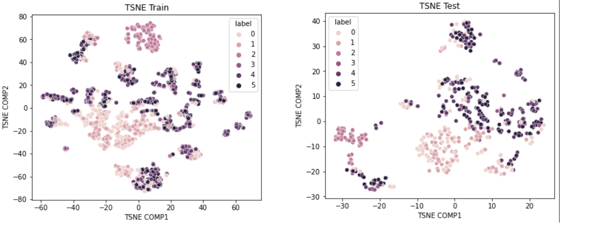

# Network Intrusion Detection with Hyperparameter Tuning

## Table of Contents

[Objective](#16)

[Team Members](#17)

[Problem's overview](#1)

- [Dataset Source](#2)

- [Multi-class Classification](#3)

[The Project Flowchart](#4)

[Results:](#5)

- [Baseline Model Accuracy](#6)

- [Feature selection and Dimentionality reduction](#7)

- [Batch size](#8)

- [Hidden Layers with No. of Neurons](#9)

- [Learning rate with Optimizer](#10)

- [Activation Function](#11)

- [Comparing Results](#12)
- [T-SNE Figures](#13)
  
- [Confusion Matrix](#14)

[Conclusion](#15)

## <a name ="16"> Objective</a>

The project was part of our AI & Data Science Master's degree at the University of Ottawa. 

Kaggle link: [Link](https://www.kaggle.com/code/mostafanofal/network-intrusion-detection-hyperparameter-tuning)

Check all the projects here: [Link](https://github.com/Mostafanofal453)

## <a name = "17">Team Members </a>

[Nada Abdellatef](https://www.linkedin.com/in/nada-abdellatef-846547181/)

[Hadeer Mamdooh](https://www.linkedin.com/in/hadeer-mamdooh-204522171/)

[Mostafa Nofal](https://www.linkedin.com/in/mostafa-nofal-772625194/)

## <a name="1">Problem’s overview</a>

The problem is about the increasing of modern computer networks and their connected applications that made network infrastructures at risk of cyberattacks and intrusions. Approaches like firewalls can not detect all these attacks, so the figure shows that we have malicious users who hack the network but the firewall can't distinguish between normal or malicious users.

[ // ]: # "![image]&#40;https://drive.google.com/uc?export=view&id=15OKnLsq9qgC5XpMnc3Zh_tBXO5kPrDjU;"

The solution to the problem is the usage of machine and deep learning as Network Intrusion Detection Systems (NIDS). The figure shows that we have different types of users with different types of attacks, but the deep learning model succeeded to detect the different types of attacks and intrusions.

[ // ]: # "![image]&#40;https://drive.google.com/uc?export=view&id=111iv2OmCtmbkbE4OU-2YkOw9opdfQJvQ;"

### <a name="2">Dataset Source</a>

**The dataset is from the University of Nevada, Reno**
Link: https://www.tapadhirdas.com/unr-idd-dataset

### <a name="3">Multi-class Classification</a>
The goal of multi-class classification is to differentiate the intrusions not only from normal working conditions but also from each other. Multi-class classification helps us to learn about the root causes of network intrusions. The labels for multi-class classification in UNR-IDD are illustrated in the accompanying table.

| Label	      | Description                |
| ----------- |----------------------------|
|Normal       | 	Network Functionality.    |
|TCP-SYN      | 	TCP-SYN Flood.            |
|PortScan     | 	Port Scanning.            |
|Overflow     | 	Flow Table Overflow.      |
|Blackhole    | 	Blackhole Attack.         |
|Diversion    | 	Traffic Diversion Attack. |

## <a name="4">The Project Flowchart</a>
For the steps of our project:

- First, we implement the Exploratory data analysis on our dataset. 

- Then we scaled the data so that we can implement any process on it. 

- We applied the Multi layer perceptron model with the initialized parameters to be our baseline model. 

- After that we will try 3 different feature engineering techniques to reduce the number of features to decrease the complexity of the model

- The first technique is dimensionality reduction and the other two are ANOVA and mutual information as part of the feature selection methods.

- The best method out the 3 will be chosen to implement another Multi layer perceptron model but with another hyperparameters combination

- For the batch size, we tried changing the batch size with 32, 64 and 128 and update with the best one that achieves the highest average accuracy for both training and test accuracies.

- Then we will try implementing the model under different number of hidden layers versus number of neurons

- The first combination was one layer and from 10 to 40 number of neurons through 4 hidden layers with the same number of neurons and again, we updated with the best combination. 

- The last two steps to try with different learning rate and optimizers and finally we will try different activation functions and see the differences between the accuracies of all the combination to reach the best hyperparameters

  
  
  [ // ]: # "![image]&#40;https://drive.google.com/uc?export=view&id=1474NWuYnln3MmP-hpS4Ei4ElcVH2h1vP;"
  
  

## <a name="5">Results:</a>

### <a name="6">Baseline Model Accuracy</a>

| Max training acc | Max test acc | Min training acc | Min test acc | Avg  training acc | Avg  test acc |
| :--------------: | :----------: | :--------------: | :----------: | :---------------: | :-----------: |
|    **62.12%**    |  **67.37%**  |    **50.47%**    |  **48.84%**  |    **59.59%**     |  **60.28%**   |

### <a name="7">Feature selection and Dimensionality reduction</a>

|                    | Best Feature Number | AVG\_valid\_acc         |
| ------------------ | ------------------- | ----------------------- |
| PCA                | **3**               | **65.41%**              |
| <mark>ANOVA</mark> | <mark>**14**</mark> | <mark>**66.66%**</mark> |
| Mutual Information | **20**              | **65.77%**              |

### <a name="8">Batch size</a>

| **Batch size= 32** | -            | -             | -            |       -        |       -       |       -       | **Batch size= 64** |       -       |      -       |       -        |       -       |       -       | **Batch size= 128** |       -       |      -       |       -        |                     -                      |
| ------------------ | ------------ | ------------- | ------------ | :------------: | :-----------: | :-----------: | :----------------: | :-----------: | :----------: | :------------: | :-----------: | :-----------: | :-----------------: | :-----------: | :----------: | :------------: | :----------------------------------------: |
| Max train acc      | Max test acc | Min train acc | Min test acc | Avg  train acc | Avg  test acc | Max train acc |    Max test acc    | Min train acc | Min test acc | Avg  train acc | Avg  test acc | Max train acc |    Max test acc     | Min train acc | Min test acc | Avg  train acc | <mark>  **Avg**  **test** **acc**  </mark> |
| **71.21**          | **72.9**     | **23.17**     | **69.87**    |   **68.76**    |   **71.08**   |   **72.47**   |     **72.01**      |   **17.64**   |  **70.58**   |   **69.56**    |   **71.47**   |   **71.7**    |      **74.33**      |   **27.97**   |  **71.56**   |   **68.01**    |         <mark>  **72.72** </mark>          |

### <a name="9">Hidden Layers with No. of Neurons</a>

|                                         | **1 hidden layer** |      -       |       -       |      -       |       -        |       -       | **2 hidden layer** |      -       |       -       |      -       |       -        |       -       | **4 hidden layer** |      -       |       -       |      -       |       -        |              -               | **8 hidden layer** |      -       |       -       |      -       |       -        |       -       |
| :-------------------------------------: | :----------------: | :----------: | :-----------: | :----------: | :------------: | :-----------: | :----------------: | :----------: | :-----------: | :----------: | :------------: | :-----------: | :----------------: | :----------: | :-----------: | :----------: | :------------: | :--------------------------: | :----------------: | :----------: | :-----------: | :----------: | :------------: | :-----------: |
| **# of** **neurons** **for each layer** |   Max train acc    | Max test acc | Min train acc | Min test acc | Avg  train acc | Avg  test acc |   Max train acc    | Max test acc | Min train acc | Min test acc | Avg  train acc | Avg  test acc |   Max train acc    | Max test acc | Min train acc | Min test acc | Avg  train acc | <mark> Avg test acc  </mark> |   Max train acc    | Max test acc | Min train acc | Min test acc | Avg  train acc | Avg  test acc |
|                   10                    |      **72.2**      |   **73.8**   |   **27.18**   |  **69.87**   |   **69.14**    |   **71.44**   |     **71.55**      |  **73.61**   |   **21.95**   |  **71.65**   |   **67.69**    |   **72.26**   |      **73.5**      |  **76.47**   |   **27.94**   |   **72.9**   |   **69.04**    |          **74.54**           |     **66.97**      |  **73.44**   |   **25.23**   |  **64.52**   |   **63.72**    |   **68.52**   |
|                   20                    |     **73.53**      |  **74.15**   |   **24.62**   |  **71.65**   |   **70.79**    |   **72.79**   |     **75.06**      |  **75.75**   |   **20.23**   |  **74.15**   |   **72.16**    |   **75.22**   |      **77.2**      |  **77.89**   |   **32.95**   |   **75.4**   |    **74.3**    |  <mark>  **76.64**  </mark>  |     **78.57**      |  **77.36**   |   **25.27**   |  **72.54**   |   **93.79**    |   **72.54**   |
|                   30                    |     **75.75**      |  **75.22**   |   **35.85**   |  **71.65**   |   **73.29**    |   **74.18**   |     **76.97**      |    **77**    |   **28.94**   |  **73.79**   |   **74.74**    |   **75.8**    |     **78.46**      |  **78.78**   |   **33.44**   |  **70.23**   |   **75.36**    |            **76**            |     **78.23**      |  **79.67**   |   **25.08**   |  **72.72**   |   **74.64**    |   **76.54**   |
|                   40                    |     **75.71**      |  **75.75**   |   **32.45**   |  **73.08**   |   **73.26**    |   **74.75**   |     **78.12**      |  **77.71**   |   **41.77**   |  **74.68**   |   **75.65**    |   **76.43**   |     **78.84**      |  **77.36**   |   **37.91**   |  **72.54**   |   **76.14**    |          **74.86**           |     **80.22**      |  **77.71**   |   **33.52**   |   **70.4**   |   **76.74**    |   **74.15**   |

### <a name="10">Learning rate with Optimizer</a>

|                     | **Learning rate=0.1** |      -       |       -       |      -       |       -        |       -       | **Learning rate=0.01** |           -            |       -       |      -       |       -        |              -               | **Learning rate=0.001** |      -       |       -       |      -       |       -        |       -       |
| :-----------------: | :-------------------: | :----------: | :-----------: | :----------: | :------------: | :-----------: | :--------------------: | :--------------------: | :-----------: | :----------: | :------------: | :--------------------------: | :---------------------: | :----------: | :-----------: | :----------: | :------------: | :-----------: |
|    **optimizer**    |   Max train    acc    | Max test acc | Min train acc | Min test acc | Avg  train acc | Avg  test acc |    Max train    acc    | Max    test        acc | Min train acc | Min test acc | Avg  train acc | <mark> Avg test acc  </mark> |  Max   train      acc   | Max test acc | Min train acc | Min test acc | Avg  train acc | Avg  test acc |
|        AdamW        |       **67.04**       |  **69.16**   |   **39.21**   |   **60.6**   |    **55.7**    |   **65.27**   |       **84.34**        |       **79.67**        |   **53.57**   |  **74.86**   |    **80.5**    |  **<mark>  78.11  </mark>**  |        **79.3**         |  **78.25**   |   **34.51**   |  **70.76**   |   **76.84**    |   **74.65**   |
| SGD (momentum =0.1) |       **95.34**       |  **78.25**   |   **46.08**   |  **70.94**   |   **87.93**    |   **75.57**   |       **84.72**        |       **77.36**        |   **25.62**   |   **70.4**   |   **78.39**    |          **74.29**           |        **74.6**         |  **73.61**   |   **25.65**   |  **71.47**   |   **64.49**    |   **72.4**    |
| SGD (momentum =0.5) |       **97.13**       |  **79.32**   |   **51.35**   |  **72.37**   |     **90**     |   **75.61**   |       **89.61**        |       **79.32**        |    **21**     |  **69.87**   |    **82.9**    |          **74.11**           |        **77.54**        |  **75.57**   |   **18.21**   |  **72.72**   |   **70.25**    |   **74.33**   |
| SGD (momentum =0.9) |       **79.45**       |  **78.96**   |   **23.29**   |  **78.96**   |   **56.47**    |   **78.96**   |       **94.76**        |       **78.25**        |   **37.68**   |  **73.08**   |   **87.55**    |          **75.86**           |        **84.84**        |  **79.67**   |   **15.84**   |  **71.12**   |   **78.04**    |   **74.83**   |
|        Rprop        |       **79.45**       |  **78.96**   |   **23.29**   |  **78.96**   |   **56.47**    |   **78.96**   |       **94.27**        |       **77.36**        |   **45.32**   |  **69.69**   |    **88.3**    |          **73.54**           |        **94.95**        |  **79.85**   |   **42.38**   |  **72.72**   |   **89.19**    |    **76**     |

### <a name="11">Activation Function</a>

|      Relu      |       -       |       -        |       -       |       -        |      -       |  Leaky  Relu  |      -       |       -       |      -       |       -        |       -       |    Sigmoid     |      -       |       -       |      -       |       -        |       -       |     Tanh      |      -       |       -       |      -       |       -        |              -              |
| :------------: | :-----------: | :------------: | :-----------: | :------------: | :----------: | :-----------: | :----------: | :-----------: | :----------: | :------------: | :-----------: | :------------: | :----------: | :-----------: | :----------: | :------------: | :-----------: | :-----------: | :----------: | :-----------: | :----------: | :------------: | :-------------------------: |
| Max  train acc | Max  test acc | Min  train acc | Min  test acc | Avg  train acc | Avg test acc | Max train acc | Max test acc | Min train acc | Min test acc | Avg  train acc | Avg  test acc | Max train  acc | Max test acc | Min train acc | Min test acc | Avg  train acc | Avg  test acc | Max train acc | Max test acc | Min train acc | Min test acc | Avg  train acc | <mark>  Avg test acc</mark> |
|   **83.27**    |   **81.63**   |   **59.37**    |   **75.04**   |   **80.56**    |  **77.57**   |   **80.48**   |  **80.21**   |   **60.63**   |  **73.79**   |   **77.38**    |   **77.21**   |   **77.47**    |  **78.96**   |   **30.39**   |  **69.87**   |   **74.43**    |   **74.4**    |   **86.36**   |   **80.3**   |   **62.04**   |  **74.33**   |   **81.99**    |  <mark>  **77.86** </mark>  |

### <a name="12">Comparing Results</a>

#### <a name="13">T-SNE Figures</a>
Original Dataset

[//]: # (![image]&#40;https://drive.google.com/uc?export=view&id=1wSH60vMIqFqKtoxtKWxkTkp-hpx-75S8;)

PCA Transformed Dataset

[//]: # (![image]&#40;https://drive.google.com/uc?export=view&id=1sKM0NMSQ9l1hfN_wzpV6op_JskKFxLWr;)

ANOVA Selected Features

[//]: # (![image]&#40;https://drive.google.com/uc?export=view&id=1YR3u-5cAZhT_5afiqB6gqwO5nhsQjuRo;)

#### <a name="14">Confusion Matrix</a>

| Base Line Model   | After The Feature Selection  | After The Parameter Selection |
|-------------------|------------------------------|-------------------------------|
|  |  |  |

[//]: # (| ![image]&#40;https://drive.google.com/uc?export=view&id=1WlBMftTONCDkqK1jBrHCh5uAUIEzBBvU; | ![image]&#40;https://drive.google.com/uc?export=view&id=1okMadmfZsPFrHRcNrvs_ES1IF_OpOat9;        | ![image]&#40;https://drive.google.com/uc?export=view&id=1UW-627kW0QZacFYA6WBOz6IKoTjmv2s7;  |)

## <a name="15">Conclusion</a>

- EDA was performed to get insights from the data set and describe it.

- Baseline performance was applied on MLP model with testing accuracy 60%

- We updated the data set based on ANOVA which was the best of our 3 feature engineering methods.

- Build MLP with the best hyperparameters:

| Parameters             | Best Choice        |
| ---------------------- | ------------------ |
| Feature Selection      | ANOVA              |
| Batch Size             | 64                 |
| Hidden Layer + Neurons | 4 & 40             |
| Optimizer              | AdamW with lr 0.01 |
| Activation Function    | tanh               |
